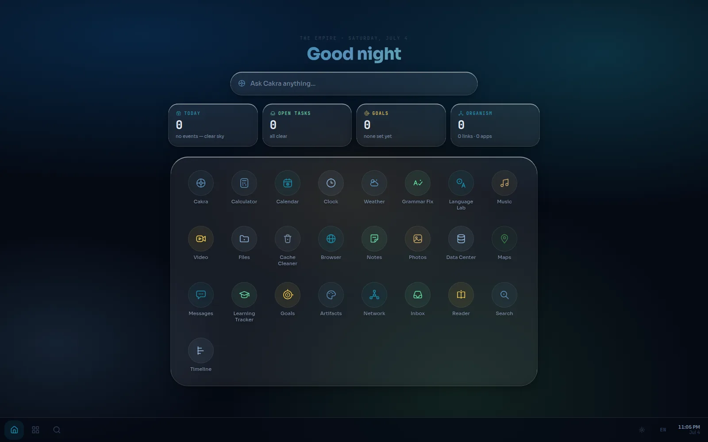
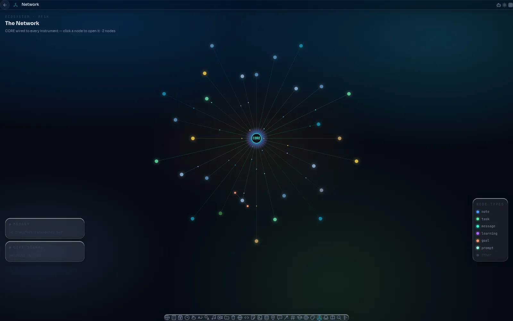

# The Empire 🏛️

**An offline-first personal web desktop — 29 integrated apps, one living organism, powered by the Cakra AI agent.**

[](https://github.com/JondriDev/empire/actions/workflows/verify.yml)
[](https://github.com/JondriDev/empire/actions/workflows/pages.yml)
[](https://github.com/JondriDev/empire/actions/workflows/android.yml)

### ▶️ [Open The Empire](https://jondridev.github.io/empire/)



Runs in any browser — **no install required**. On your phone or desktop, tap
**Install app** / **Add to Home screen** and it opens like a native app.

| Version | How to get it |
|---------|---------------|
| 🌐 **Web app** | [jondridev.github.io/empire](https://jondridev.github.io/empire/) — open instantly |
| 🖥️ **Desktop app** | Same link → browser menu → **Install** (installable PWA) |
| 📱 **Android app** | Download the APK from the [Android APK workflow](https://github.com/JondriDev/empire/actions/workflows/android.yml) → artifact `the-empire-debug-apk` |

The Empire is a full-featured, offline-first application suite with a
holographic **Liquid Glass** UI — recovered-alien-technology aesthetic:
deep-field darkness, glass surfaces, light used sparingly as accent. Built with
React 19, TypeScript, and Vite, it packs **29 integrated apps** into a
full-screen desktop shell, with AI woven throughout by **Cakra** — a
multi-model AI agent that can act across your apps.

It's not 29 loose apps: a shared node-graph and event bus interconnect them
into one living organism, visible in the **Network** app.



---

## 🚀 Features

- **29 integrated apps** — Cakra, Notes, Calendar, Reader, Artifacts, Network, and more
- **Cakra AI** — a multi-model agent wired into every AI-enabled app; Prompt, Tokens, Code, and Problem Solver live inside it as tabs
- **One living organism** — a shared node-graph + event bus interconnect the apps (see **Network**); handoffs carry provenance between them
- **Offline-first PWA** — installable, cold-boots fully offline from a precached shell
- **Holographic glass design** — the "Earth-from-Space" palette on one design-token system (zero hardcoded colors, CI-enforced)
- **Local-first persistence** — LocalStorage + IndexedDB (durable media blobs); your data stays on your device

### App inventory

All 29 apps are declared in [`src/lib/registry.ts`](./src/lib/registry.ts) —
the single source of truth. The launcher grid shows **25**; **Code Editor**,
**Prompt Gen**, **Token Counter**, and **Problem Solver** are merged into
**Cakra** as tabs and answer their legacy routes as hidden aliases.

| App | Description | AI |
|-----|-------------|----|
| **Cakra** | Chat that acts — your AI (Chat · Prompt · Tokens · Code · Solver tabs) | ✅ |
| **Calculator** | Scientific calculations | ✅ |
| **Calendar** | Schedule & events | ✅ |
| **Clock** | Time & alarms, stopwatch, timer, world clocks | ❌ |
| **Weather** | Forecasts & conditions (Open-Meteo, no key needed) | ❌ |
| **Grammar Fix** | Fix your writing | ✅ |
| **Language Lab** | Learn new languages (Cakra translation) | ✅ |
| **Music** | Play your tracks (durable IndexedDB blobs) | ❌ |
| **Video** | Watch videos (durable IndexedDB blobs) | ❌ |
| **Files** | Browse files | ❌ |
| **Cache Cleaner** | Free up space | ❌ |
| **Browser** | Browse the web | ✅ |
| **Code Editor** _(→ Cakra · Code tab)_ | Write & edit code | ✅ |
| **Notes** | Write & organize (Markdown + tags) | ✅ |
| **Photos** | Your gallery (durable IndexedDB blobs) | ❌ |
| **Data Center** | Manage data (local-first, offline) | ✅ |
| **Maps** | Explore locations (Leaflet + OpenStreetMap) | ❌ |
| **Messages** | Chat over WiFi | ✅ |
| **Prompt Gen** _(→ Cakra · Prompt tab)_ | Craft AI prompts | ✅ |
| **Token Counter** _(→ Cakra · Tokens tab)_ | Count AI tokens | ✅ |
| **Learning Tracker** | Track & challenge yourself | ✅ |
| **Goals** | Set goals, track progress | ✅ |
| **Artifacts** | Self-contained mini-apps & builders (charts, kanban, forms…) | ✅ |
| **Network** | The ecosystem as a live node-graph | ❌ |
| **Inbox** | Every open task, one home | ❌ |
| **Reader** | Read your books (EPUB/PDF/MD/TXT/DOCX) · ask Cakra | ✅ |
| **Search** | Find anything across every app | ❌ |
| **Timeline** | The organism's history, one stream | ❌ |
| **Problem Solver** _(→ Cakra · Solver tab)_ | Cakra solves problems — world to personal | ✅ |

---

## 🛠️ Tech stack

| Layer | Technology |
|-------|-----------|
| **Framework** | React 19 |
| **Language** | TypeScript 5.6 |
| **Bundler** | Vite 5 |
| **Styling** | Tailwind CSS 4 + token-based design system |
| **Routing** | React Router 7 |
| **State** | Zustand 5 |
| **Animation** | CSS spring/ease design tokens (no animation library) |
| **Maps** | Leaflet 1.9 (+ OpenStreetMap / Nominatim) |
| **Reader** | pdfjs-dist 6 · epubjs · mammoth (DOCX) |
| **Icons** | Lucide (controls) + bespoke alien SVG set (app identity) |
| **PWA** | vite-plugin-pwa (Workbox precache) |
| **Android** | Capacitor 8 |
| **Backend** _(optional)_ | Express 5 + ws (WebSocket) |

---

## 📦 Quick start

Requires **Node.js 20+** (see `.nvmrc`). No local server or PC is required to
*use* The Empire — it runs entirely in the browser. These steps are for
building and developing it locally.

```bash
git clone https://github.com/JondriDev/empire.git
cd empire
npm install

npm run dev       # start the dev server
npm run build     # production build (tsc + vite)
npm test          # vitest
```

### Optional local backend

The deployed PWA needs no backend. A local Express server (`server.js`) adds
file access, WebSocket, and an AI proxy for self-hosted setups:

```bash
cp .env.example .env   # every variable optional; secure defaults apply
npm run server         # binds 127.0.0.1:3001 by default
```

Configuration lives in [`.env.example`](./.env.example) (`EMPIRE_*` variables).
The server ships hardened defaults: localhost-only bind, CORS allowlist, agent
shell/code tools disabled, no baked-in secrets — see [SECURITY.md](./SECURITY.md).

---

## 🎨 Design system

One token-backed design system — the **"Earth-from-Space"** palette on a
**Liquid Glass** UI. Every color resolves to a CSS custom property in
`src/design-system/colors_and_type.css`, so the whole shell re-themes from one
place; raw hex/rgb literals and off-system utilities are **0, CI-enforced**
(`node scripts/metrics.mjs --assert-zero`).

- **Deep-field near-black space** with overlapping radial washes as the backdrop
- **Holographic glass** surfaces via the `.gp` primitive (blur + border highlights)
- **Accents** — signal / aurora / plasma / ion / ember / xenon — used sparingly as *light*, not fill
- **Type** — Sora + JetBrains Mono, both vendored (renders identically offline)
- **Motion** — physics-based spring/ease tokens; things glide, settle, breathe

---

## 🔌 Architecture

```
empire/
├── src/
│   ├── apps/              # One folder per app
│   ├── components/        # Shared shell UI (Bridge, AppHost, Recents…)
│   ├── design-system/     # Earth-from-Space tokens + vendored fonts + alien icons
│   ├── lib/               # Registry, stores, event bus, core graph, AI client
│   ├── App.tsx            # Router
│   └── main.tsx           # Entry point
├── docs/                  # Documentation + the fleet's shared memory (see docs/README.md)
├── scripts/               # Launcher + CI guard scripts (metrics, parity, PWA audits)
├── public/                # Icons, manifest, solver feed
├── android/               # Capacitor Android project
├── server.js              # Optional Express backend
└── vite.config.ts
```

Apps communicate through a central event bus and mirror their entities into a
shared node-graph — that's what the **Network** app renders. Deep-dive docs:

- [docs/ARCHITECTURE.md](./docs/ARCHITECTURE.md) — stack, modules, API surface
- [docs/DEVELOPMENT.md](./docs/DEVELOPMENT.md) — dev guide: scripts, quality gates, adding an app, event bus, WebSocket API
- [docs/PACKAGING.md](./docs/PACKAGING.md) — PWA install + Android APK builds
- [docs/README.md](./docs/README.md) — full documentation index

### Built by an autonomous fleet

This repo is continuously built and maintained by a fleet of autonomous
Claude Code routines — they plan epics, ship stages, run visual QA, measure a
fitness field, and commit directly to `main` around the clock. The fleet's
shared memory and specs live in [`docs/`](./docs/README.md).

---

## 🧪 Quality gates

Every change — human or fleet — must keep six gates green (enforced by the
**Verify build** workflow on PRs):

```bash
npm run build                            # tsc + vite build
npx vitest run                           # unit + audit tests
npx eslint .                             # lint
node scripts/check-shell-styled.mjs      # shell CSS contract
node scripts/check-route-parity.mjs      # registry ↔ components parity
node scripts/metrics.mjs --assert-zero   # design-system conformance ratchet
```

---

## 🤝 Contributing & security

- [CONTRIBUTING.md](./CONTRIBUTING.md) — setup, gates, commit conventions, and
  how to coexist with the autonomous fleet
- [SECURITY.md](./SECURITY.md) — reporting vulnerabilities, server hardening
  summary

---

**© 2026 Jondri (JondriDev)** · *The Empire — all your apps, one organism.*
